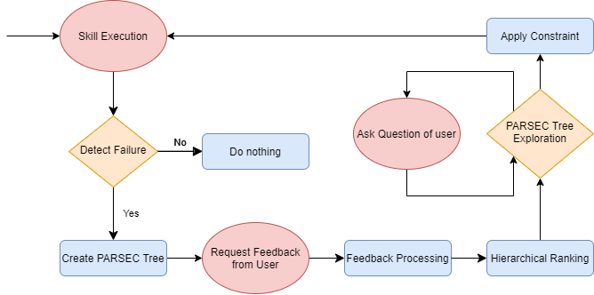
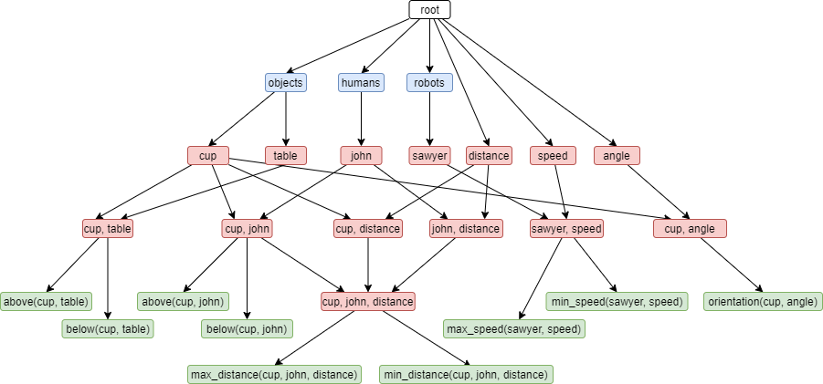

[](https://travis-ci.com/jgkawell/parsec)

# parsec

A Python implementation of the PARSEC (Plan Augmentation and Repair through SEmantic Constraints) algorithm.

[Paper Link](https://ieeexplore.ieee.org/document/9636375)

## Overview

Developments in human-robot teaming have given rise to significant interest in training methods that enable collaborative agents to effectively execute tasks alongside human teammates. While effective, many existing methods are brittle to changes in the environment and do not account for the preferences of human collaborators. This ineffectiveness is typically due to the complexity of deployment environments and the unique personal preferences of human teammates. These complications lead to behavior that can cause task failure or user discomfort.

This repository contains a Python implementation of Plan Augmentation and Repair through SEmantic Constraints (PARSEC): a novel algorithm that utilizes a semantic hierarchy along with natural language processing (NLP) to enable novice users to quickly and effectively select constraints that correct faulty behavior or adapt skills to their preferences.

Below is a diagram of a skill repair system utilizing the PARSEC algorithm.



Below is an example of a partial PARSEC tree. Blue nodes represent parameter types, red nodes represent both grounded (e.g., ‘cup’) and lifted (e.g., ‘angle’) parameters and combinations of parameters, and green nodes represent fully parameterized constraints. Lifted parameters are resolved to grounded values after they are assigned to a parameterized constraint.



## Installation

The PARSEC algorithm can be installed using `pip` on both Python 2.7 and Python 3.*. It will be installed with the package name `parsec`. To install, simply run the below command after cloning and moving into the repository:

```bash
pip install .
```

## Usage

Coming soon...
